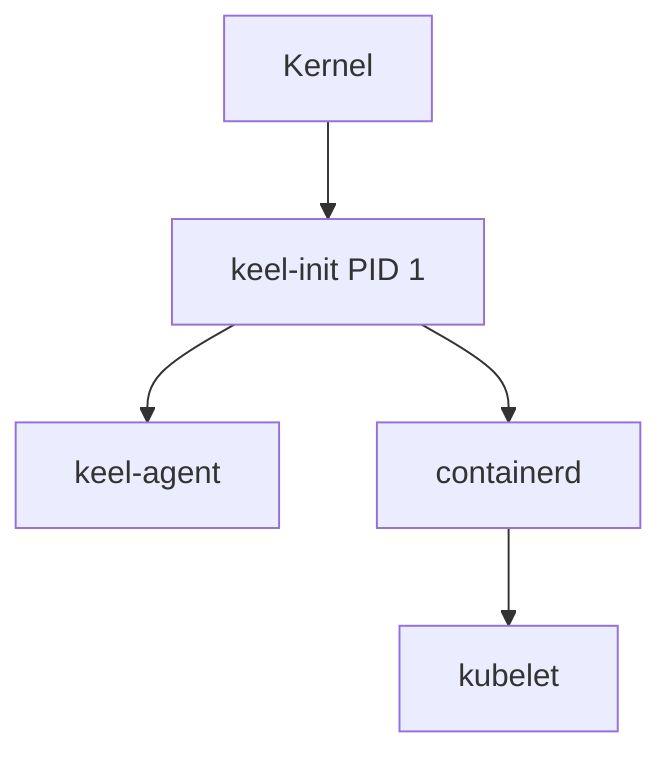

# AGENTS.md

> Guidance for AI agents contributing to KeelOS.

## Project Overview

KeelOS is an **immutable, API-driven Linux distribution** designed exclusively for hosting Kubernetes workloads. It replaces the traditional userspace (Shell, SSH, Systemd) with a single-binary PID 1 (`keel-init`) and a gRPC-based management API (`keel-agent`).

### Key Concepts

- **PID 1**: `keel-init` — Custom init system (never use systemd terminology)
- **API-Driven**: All management via gRPC, no SSH/shell access
- **Immutable**: Read-only SquashFS root filesystem with atomic A/B partition updates
- **Minimalist**: <100MB total OS footprint; only essential components (kernel, init, agent, containerd, kubelet)
- **Security**: mTLS everywhere, kernel lockdown, no interpreters

### Terminology

Use KeelOS-specific terms consistently:

| ✅ Correct | ❌ Avoid |
|-----------|---------|
| `keel-init` (PID 1) | init system, systemd |
| `keel-agent` (management API) | daemon, service |
| `osctl` (admin CLI) | SSH, remote shell |
| SquashFS root | root partition, / |
| A/B partitions | dual boot, backup |
| gRPC API | REST API, HTTP API |
| Immutable OS | read-only filesystem |

## Repository Structure

| Directory | Purpose |
|-----------|---------|
| `/kernel` | Minimalist Linux kernel configuration and patches |
| `/pkg` | Shared Rust/Go libraries for OS components |
| `/cmd` | Binaries: `keel-init`, `keel-agent`, `osctl` |
| `/crates` | Rust workspace crates |
| `/system` | Static manifests and bootstrap configuration |
| `/tools` | Build systems and test harnesses |
| `/docs` | End-user documentation |
| `/.ai-context` | Developer guidelines and style rules |

## Critical Rules

1. **No Panics in PID 1**: The `keel-init` binary is PID 1 and **must never panic**. Always use `Result<T, E>` with proper error handling.
2. **Memory Safety**: All system components (PID 1, Agent) are written in **Rust**. Tooling may use Go.
3. **Minimal Dependencies**: Audit every crate. Prefer `std` where possible.
4. **Static Linking**: All binaries must be statically linked using `x86_64-unknown-linux-musl`.
5. **Containerized Builds**: All builds must run inside a container for reproducibility:
   ```bash
   ./tools/builder/build.sh
   ```
6. **Feature Branches**: Never commit directly to `main`. Create feature branches and submit PRs.
7. **Tests Required**: All new code requires unit tests. System changes require verification scripts in `tools/testing/`.

## Build & Test

```bash
# Build the OS image (runs in container)
./tools/builder/build.sh

# Run in QEMU for testing
./tools/testing/run-qemu.sh

# Run boot tests
./tools/testing/test-boot.sh
```

## Coding Standards

### Rust

- **Formatter**: `rustfmt` with default settings.
- **Lints**: Comprehensive linting configured in:
  - `clippy.toml` — Project-specific clippy configuration
  - `Cargo.toml` — Workspace-level lint rules (`[workspace.lints]`)
  - Enabled lint groups:
    - `clippy::all` (deny) — All clippy lints
    - `clippy::pedantic` (warn) — Opinionated but helpful lints
    - `clippy::nursery` (warn) — Experimental but useful checks
    - `clippy::cargo` (warn) — Cargo manifest lints
  - Critical denials for PID 1 safety:
    - `unwrap_used` — Prevents `.unwrap()` calls
    - `expect_used` — Prevents `.expect()` calls
    - `panic` — Prevents explicit `panic!()` macros
    - These are allowed in test code only
  - Must pass `cargo clippy --workspace -- -D warnings` (enforced in CI)
- **Error Handling**:
  - ❌ `unwrap()` or `expect()` in runtime code (enforced by lints)
  - ✅ `?` operator or explicit matching
  - ✅ Proper error documentation with `/// # Errors`
- **Running Lints Locally**:
  ```bash
  # Check all lints (same as CI)
  cargo clippy --workspace -- -D warnings

  # Auto-fix some issues
  cargo clippy --workspace --fix

  # Check formatting
  cargo fmt --all -- --check
  ```
- **Async**: Use `tokio` for the Agent. `keel-init` should remain synchronous where possible for simplicity, or use a minimal executor if needed.

### Commit Messages

Follow [Conventional Commits](https://www.conventionalcommits.org/):

- `feat: add network interface configuration`
- `fix(init): correctly reap zombie processes`
- `docs: update architecture spec`
- `chore: bump kernel version`

### Commit Strategy

1. **Atomic Changes**: Each commit must represent a single, logical unit of work.
2. **Linear History**: Maintain a linear git history. Rebase your changes on top of `main`.
3. **PR Squashing**: Feature branches should be squashed into descriptive, single commits before merging.

## Testing Guidelines

1. **Unit Tests**: Mandatory for all new logic. In Rust, use `#[cfg(test)]` modules within the same file.
2. **Verification Scripts**: New features affecting system boot or artifact creation must be covered by scripts in `tools/testing/`.
3. **E2E Tests**: Significant system-wide changes (e.g., networking, container lifecycle) require end-to-end tests using the QEMU-based testing framework.
4. **No Regressions**: All existing tests and verification scripts must pass before merging.

## PR Reviews

Every PR description **must follow the [PULL_REQUEST_TEMPLATE](./.github/PULL_REQUEST_TEMPLATE.md)**, including:
- A clear description and linked issue(s)
- The type of change checked off
- A release note (or `NONE`)
- A documentation link (or `NONE`/`TBD`)

All pull requests are reviewed by Claude AI to ensure:
- Code quality and lint compliance
- Proper error handling (especially for PID 1 components)
- Test coverage for new features
- Documentation updates when needed
- Compliance with commit message conventions

Claude will provide feedback on the PR and may request changes before approval.

## Documentation Strategy

### Writing Style

1. **Be Concise**: KeelOS users are system engineers, not beginners.
2. **Use Code Examples**: Show actual commands and output.
3. **Explain "Why"**: Document design decisions, not just "what".
4. **Security First**: Always mention security implications.
5. **No Assumptions**: Don't assume systemd, traditional Linux tools.

### Documentation Structure

All user-facing documentation lives in `/docs`:
- `architecture.md` — System design, boot sequence, update mechanism
- `getting-started.md` — Building from source, running locally
- `installation.md` — Installing from pre-built images
- `using-osctl.md` — Remote administration CLI reference

Component-specific documentation lives in component `README.md` files (e.g., `/cmd/keel-init/README.md`).

### Code-Level Documentation

- **Rust**: Public items (`pub`) generally require `///` doc comments. Complex internal logic needs `//` comments explaining *why*, not *what*.
- **Shell**: Functions require a header comment block explaining usage and arguments.

### Component Documentation

- Every crate in `crates/` and significant tool in `tools/` must have a `README.md`.
- Include: **Overview**, **Build Instructions**, and **Usage Examples**.

### CLI User Experience

- All CLI tools must implement `--help`.
- Use distinct 'long' vs 'short' help where applicable.

### Architecture Diagrams

When updating `architecture.md`, use Mermaid diagrams for clarity:



### When Code Changes Affect Docs

| Change Type | Documentation to Update |
|-------------|------------------------|
| New `osctl` command | `/docs/using-osctl.md` — Add command reference |
| Build process change | `/docs/getting-started.md` — Update build steps |
| API endpoint added | `/docs/architecture.md` + component README |
| Boot sequence change | `/docs/architecture.md` — Update boot flow diagram |
| New dependency | `/docs/installation.md` — Update requirements |
| Configuration option | Component README + `/docs/getting-started.md` |

### API Documentation Format

For `keel-agent` gRPC APIs:

```markdown
### EndpointName

Description of the endpoint.

**Request:**
- `field` (type) - Description

**Response:**
- `field` (type) - Description

**Example (osctl):**
```bash
osctl command --flag value
```

## GitHub Interactions

- **Always use the GitHub CLI (`gh`) for all GitHub operations**
- Use `gh pr`, `gh run`, `gh api` instead of browser interactions
- Examples:
  - View PR checks: `gh pr checks <pr-number>`
  - View run logs: `gh run view <run-id> --log`
  - Check run status: `gh run list --branch <branch>`
- Only use the browser for creating PRs when the CLI prompt is insufficient

## Key References

- [Architecture](./docs/architecture.md) — System design and boot sequence
- [Getting Started](./docs/getting-started.md) — Build from source
- [CHANGELOG](./CHANGELOG.md) — Release notes

## Questions?

If you encounter ambiguity:
1. Check existing documentation for patterns
2. Review similar OS projects (Talos Linux, Flatcar, Bottlerocket)
3. Default to security and simplicity
4. When in doubt, ask for clarification in the PR

Remember: KeelOS is opinionated software. Documentation should reflect that confidence while remaining helpful.
