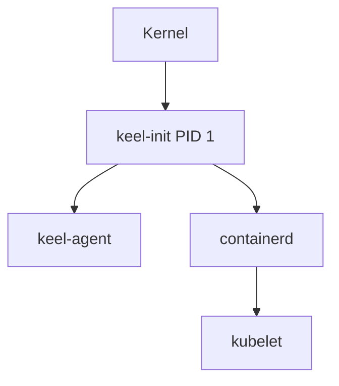

# Claude Code Guidelines for KeelOS

This document provides project-specific guidance for Claude Code when working on KeelOS documentation and code.

## Project Overview

KeelOS is an **immutable, API-driven Linux distribution** designed exclusively for Kubernetes nodes. It eliminates traditional userspace components in favor of a minimal, secure architecture.

### Key Concepts

- **PID 1**: `keel-init` - Custom init system (never use systemd terminology)
- **API-Driven**: All management via gRPC, no SSH/shell access
- **Immutable**: Root filesystem is read-only SquashFS
- **A/B Updates**: Atomic partition swapping for updates
- **Minimalist**: <100MB total OS footprint
- **Security**: mTLS everywhere, kernel lockdown, no interpreters

## Documentation Standards

### Structure

All user-facing documentation lives in `/docs`:
- `architecture.md` - System design, boot sequence, update mechanism
- `getting-started.md` - Building from source, running locally
- `installation.md` - Installing from pre-built images
- `using-osctl.md` - Remote administration CLI reference

Component-specific documentation lives in component `README.md` files (e.g., `/cmd/keel-init/README.md`).

### Writing Style

1. **Be Concise**: KeelOS users are system engineers, not beginners
2. **Use Code Examples**: Show actual commands and output
3. **Explain "Why"**: Document design decisions, not just "what"
4. **Security First**: Always mention security implications
5. **No Assumptions**: Don't assume systemd, traditional Linux tools

### Terminology

Use KeelOS-specific terms consistently:

| ✅ Correct | ❌ Avoid |
|-----------|---------|
| `keel-init` (PID 1) | init system, systemd |
| `keel-agent` (management API) | daemon, service |
| `osctl` (admin CLI) | SSH, remote shell |
| SquashFS root | root partition, / |
| A/B partitions | dual boot, backup |
| gRPC API | REST API, HTTP API |
| Immutable OS | read-only filesystem |

### Code Examples

Always include working examples:

```bash
# Build the OS image
cd /path/to/matic
./tools/builder/build.sh

# Run in QEMU for testing
./tools/testing/run-qemu.sh
```

### Architecture Diagrams

When updating `architecture.md`, use Mermaid diagrams for clarity:



## Code Review Guidelines

When reviewing code, check for:

1. **Safety in PID 1**: `keel-init` code MUST use `Result<T,E>`, never `panic!`, `unwrap()`, or `expect()`
2. **Static Linking**: All binaries must be statically linked with musl
3. **Test Coverage**: New code requires unit tests
4. **Build in Container**: All builds must run in Docker/Podman
5. **Async Correctness**: Verify tokio usage in async code
6. **Lint Compliance**: Rust code must pass `clippy::pedantic`
7. **Conventional Commits**: Commit messages follow [Conventional Commits](https://www.conventionalcommits.org/)

See `.ai-context/STYLE_GUIDE.md` for full development guidelines (if it exists).

## Common Documentation Updates

### When Code Changes Affect Docs

| Change Type | Documentation to Update |
|-------------|------------------------|
| New `osctl` command | `/docs/using-osctl.md` - Add command reference |
| Build process change | `/docs/getting-started.md` - Update build steps |
| API endpoint added | `/docs/architecture.md` + component README |
| Boot sequence change | `/docs/architecture.md` - Update boot flow diagram |
| New dependency | `/docs/installation.md` - Update requirements |
| Configuration option | Component README + `/docs/getting-started.md` |

### API Documentation Format

For `keel-agent` gRPC APIs:

```markdown
### UpdateOS

Updates the OS to a new version via A/B partition swap.

**Request:**
- `image_url` (string) - URL to new OS image
- `checksum` (string) - SHA256 checksum for verification

**Response:**
- `success` (bool) - Whether update was staged successfully
- `reboot_required` (bool) - Whether reboot is needed to activate

**Example (osctl):**
```bash
osctl update --image https://releases.keelos.dev/v1.2.3.img \
             --checksum abc123...
```

## Example Documentation

Here's an example of good KeelOS documentation style:

---

### Building the Kernel

KeelOS uses a minimalist kernel configuration optimized for container workloads.

**Prerequisites:**
- Docker or Podman
- 4GB free disk space

**Build steps:**

```bash
# All builds run in a container for reproducibility
cd /path/to/matic
./tools/builder/build-kernel.sh

# Output: kernel/build/bzImage
```

**Customization:**

To modify kernel config:
1. Edit `kernel/config/minimal.config`
2. Rebuild: `./tools/builder/build-kernel.sh`
3. Test in QEMU: `./tools/testing/run-qemu.sh`

**Security note:** The kernel runs in lockdown mode. Kernel modules are disabled to prevent runtime tampering.

---

## Links and References

- Main README: `/README.md`
- Changelog: `/CHANGELOG.md`
- Architecture: `/docs/architecture.md`
- Getting Started: `/docs/getting-started.md`
- Style Guide: `.ai-context/STYLE_GUIDE.md` (if exists)

## Questions?

If you encounter ambiguity:
1. Check existing documentation for patterns
2. Review similar OS projects (Talos Linux, Flatcar, Bottlerocket)
3. Default to security and simplicity
4. When in doubt, ask for clarification in the PR

Remember: KeelOS is opinionated software. Documentation should reflect that confidence while remaining helpful.
