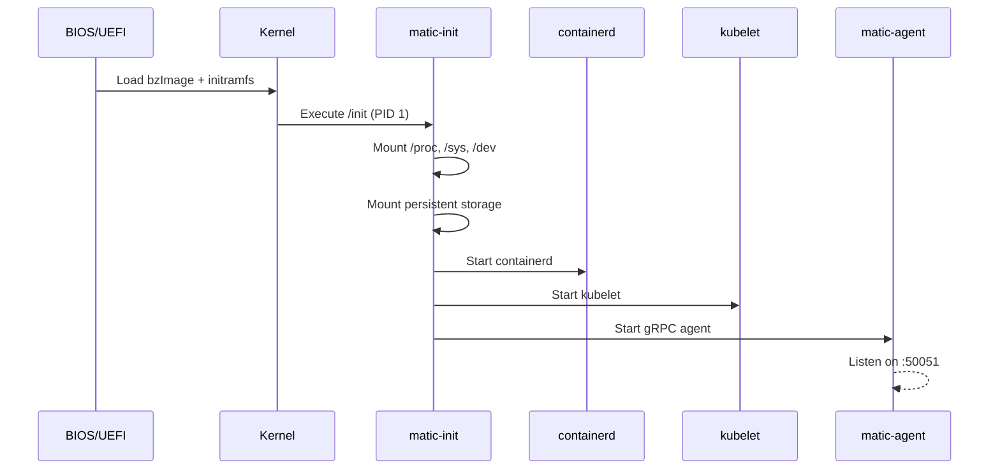

# MaticOS Architecture

This document provides a high-level overview of the MaticOS architecture.

## Design Principles

1.  **Immutable**: The OS runs from a read-only SquashFS image. No package manager. No runtime modifications.
2.  **API-Driven**: All management happens via gRPC, not SSH.
3.  **Minimal Attack Surface**: No shell, no interpreters (Python/Perl), no unnecessary services.
4.  **Atomic Updates**: A/B partition scheme ensures safe, rollback-capable updates.

## Boot Sequence

## Component Responsibilities

| Component       | Role                                      |
|-----------------|-------------------------------------------|
| `matic-init`    | PID 1. Mounts filesystems, supervises processes, reaps zombies. |
| `matic-agent`   | gRPC server. Handles updates, reboots, configuration. |
| `osctl`         | CLI client for `matic-agent`. |
| `containerd`    | Container runtime (stock, unmodified). |
| `kubelet`       | Kubernetes node agent (stock, unmodified). |

## Partition Layout

MaticOS uses a GPT partition table with the following layout:

| Partition | Label         | Purpose                        |
|-----------|---------------|--------------------------------|
| 1         | `ESP`         | EFI System Partition (unused in direct kernel boot) |
| 2         | `MATIC_ROOT_A`| Primary OS image (SquashFS)    |
| 3         | `MATIC_ROOT_B`| Secondary OS image (for updates) |
| 4         | `MATIC_STATE` | Persistent data (overlay, etcd, logs) |

## Update Mechanism

1.  `osctl install` downloads a new SquashFS image.
2.  The image is written to the *inactive* partition (e.g., if booted from A, write to B).
3.  Boot flags are updated to boot from the new partition.
4.  On `osctl reboot`, the system boots into the new version.
5.  If the new version fails to boot, a watchdog triggers a rollback to the previous partition.

## Security Model

*   **mTLS**: All gRPC communication is secured with mutual TLS.
*   **Kernel Lockdown**: (Planned) Prevents runtime modification of kernel memory.
*   **Read-Only Root**: No writable paths on the OS image.
*   **No Passwords**: No user accounts. No `/etc/passwd`. No login.
