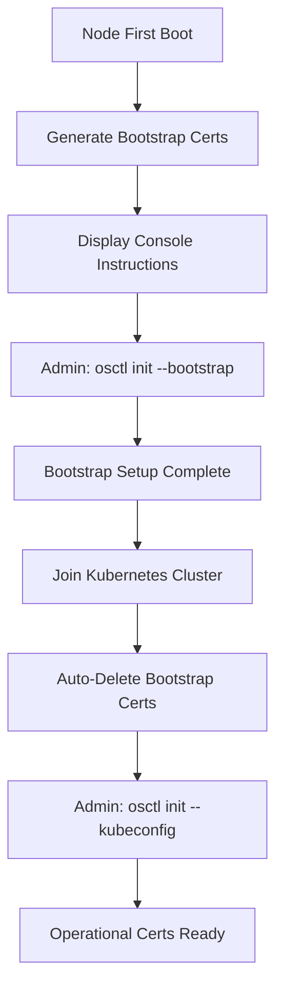

# Certificate Management

KeelOS uses a **two-tier certificate system** for secure node management:

1. **Bootstrap Certificates** (24-hour, self-signed) - for initial setup
2. **Operational Certificates** (Kubernetes PKI) - for production use

## Overview



## Bootstrap Certificates

### Automatic Generation

On first boot, `keel-init` automatically generates:
- Self-signed CA certificate (24-hour validity)
- Initial client certificate
- Stored in `/etc/keel/crypto/`

### Security Model

- **Private keys never transmitted** - CSR-based workflow
- **Short validity** - 24 hours to minimize exposure
- **Automatic cleanup** - Deleted after Kubernetes join
- **Single HTTP call** - Only `osctl init --bootstrap` uses HTTP

### Getting Bootstrap Certificates

```bash
# On admin machine
osctl init --bootstrap --node <node-ip>
```

**What happens:**
1. Generates RSA-2048 key pair locally
2. Creates Certificate Signing Request (CSR)
3. Sends CSR to node via HTTP (one-time only)
4. Node signs CSR with bootstrap CA
5. Returns signed certificate to admin
6. Saves to `~/.keel/bootstrap/`

**File locations (admin machine):**
```
~/.keel/bootstrap/
├── ca.pem          # Bootstrap CA certificate
├── client.pem      # Your signed client certificate
└── client.key      # Your private key (never transmitted)
```

### Using Bootstrap Certificates

Bootstrap certificates allow initial node setup:

```bash
# These commands use bootstrap certs automatically
osctl bootstrap --api-server https://k8s:6443 --token <token>
osctl bootstrap-status
```

## Operational Certificates

### Obtaining from Kubernetes

After the node joins a Kubernetes cluster:

```bash
osctl init --kubeconfig ~/.kube/config
```

**Options:**
- `--auto-approve`: Automatically approve the CSR (requires admin permissions)
- `--cert-name`: Custom certificate name (default: osctl-user)
- `--cert-dir`: Custom directory (default: ~/.keel)

**What happens:**
1. Generates RSA-2048 key pair locally
2. Creates CSR with subject `CN=osctl-user, O=system:osctl`
3. Submits CSR to Kubernetes API
4. Waits for approval (or auto-approves if flag set)
5. Retrieves signed certificate
6. Saves to `~/.keel/`

### Manual CSR Approval

If not using `--auto-approve`:

```bash
# List pending CSRs
kubectl get csr

# Approve your CSR
kubectl certificate approve osctl-osctl-user
```

### File Locations (admin machine)

```
~/.keel/
├── ca.pem          # Kubernetes CA certificate
├── client.pem      # Your signed client certificate  
└── client.key      # Your private key
```

## Certificate Selection

`osctl` automatically selects the appropriate certificates:

| Command | Certificates Used |
|---------|------------------|
| `osctl bootstrap ...` | Bootstrap (`~/.keel/bootstrap/`) |
| `osctl bootstrap-status` | Bootstrap (`~/.keel/bootstrap/`) |
| **All other commands** | Operational (`~/.keel/`) |

## Security Best Practices

### Bootstrap Phase
1. ✅ Complete setup within 24 hours
2. ✅ Join node to Kubernetes cluster promptly
3. ✅ Bootstrap certificates auto-delete after join
4. ✅ Only use bootstrap certs for initial setup

### Operational Phase
1. ✅ Use Kubernetes RBAC to control osctl permissions
2. ✅ Protect `~/.keel/client.key` (set to 0600)
3. ✅ Rotate certificates periodically
4. ✅ Revoke certificates when users leave

## Troubleshooting

### "Bootstrap certificates not found"

```bash
# Re-run bootstrap init
osctl init --bootstrap --node <node-ip>
```

### "Operational certificates not found"

```bash
# Get operational certificates from cluster
osctl init --kubeconfig ~/.kube/config
```

### Bootstrap certificates expired

Bootstrap certificates expire after 24 hours. If expired:
1. Node may need to be re-imaged
2. Or manually place new bootstrap certificates in `/etc/keel/crypto/`

### CSR not approved

```bash
# Check CSR status
kubectl get csr

# Manually approve
kubectl certificate approve osctl-<cert-name>
```

## Implementation Details

### Certificate Paths (Node)

```
/etc/keel/crypto/
├── bootstrap-ca.pem         # Bootstrap CA (deleted after K8s join)
├── bootstrap-ca-key.pem     # Bootstrap CA key (deleted after K8s join)
├── server.pem               # keel-agent server certificate
└── server.key               # keel-agent server key
```

### mTLS Configuration

`keel-agent` automatically selects which CA to trust:

- **Before Kubernetes join**: Trusts bootstrap CA
- **After Kubernetes join**: Trusts Kubernetes CA

This allows seamless transition from bootstrap to operational certificates.

## Advanced: Certificate Rotation

### Manual Rotation

```bash
# Delete old operational certificates
rm -rf ~/.keel/

# Request new certificates
osctl init --kubeconfig ~/.kube/config --auto-approve
```

### Automatic Rotation (TODO)

Certificate rotation support is planned for a future release.
